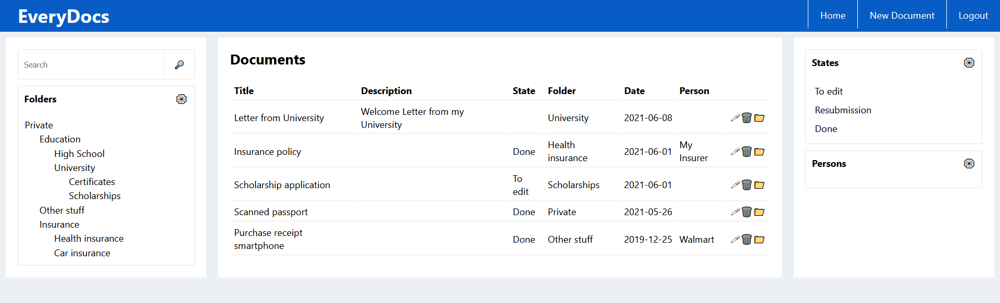
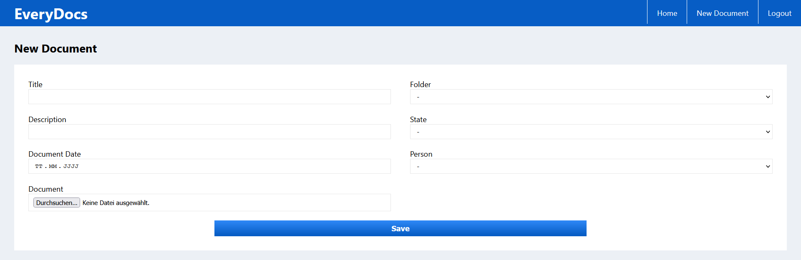

# EveryDocs Core

EveryDocs Core is the server-side part of EveryDocs. This project contains a [web interface](https://github.com/jonashellmann/everydocs-web/). All in all, EveryDocs is a simple Document Management System (DMS) for private use. It contains basic functionality to organize your documents digitally.

## Features

- Uploading PDF documents with a title, description and the date the document was created
- Organizing documents in folders and subfolders
- Adding people and processing states to documents
- Extracting the content from the PDF file for full-text search
- Encrypted storage of PDF files on disk
  - Encryption is automatically activated for all newly created users after upgrading to EveryDocs 1.5.0
  - For all other users encryption can be activated by adding a `secret_key` (generated for example by `openssl rand -hex 32`) and changing the flag `encryption_actived_flag` in the `users` database table for each user
  - If encrpytion is actived for a user, then there will be no content extraction and therefore no full-text search for this document
- Searching all documents by title, description or content of the document
- Creating new accounts (be aware that at the current moment everybody who knows the URL can create new accounts)
- Authentication via JsonWebToken
- REST-API for all CRUD operation for documents, folders, persons and processing states
- Mobile-friendly web UI

## Screenshots of the web interface

## Installation

### Docker Compose (recommended)

The easiest way to get started is to use Docker Compose. The ``docker-compose.yaml`` creates three containers for the database, Everydocs Core (available on port 5678) and the web interface (available on port 8080 and 8443).

You may simply need to changed the URL in ``./everydocs-web-config.js`` where EveryDocs Core will be accessible and execute the following command while being inside the source folder of this repository:
<pre>SECRET_KEY_BASE="$(openssl rand -hex 64)" docker-compose up --build</pre>

### Docker (recommended)

Start the container and make the API accessible on port ``8080`` by running the following commands. Of course, you can change the port in the last command.
Also make sure to check the folder that is mounted into the container. In this case, the uploaded files are stored in ``/data/everydocs`` on the host.
<pre>docker run -p 127.0.0.1:8080:5678/tcp -e SECRET_KEY_BASE="$(openssl rand -hex 64)" -v /data/everydocs:/var/everydocs-files jonashellmann/everydocs</pre>

You can configure the application by using the following environment variables:
- ``EVERYDOCS_DB_ADAPTER``: The database adapter (default: ``mysql2``)
- ``EVERYDOCS_DB_NAME``: The name of the database (default: ``everydocs``)
- ``EVERYDOCS_DB_USER``: The user for the database connection (default: ``everydocs``)
- ``EVERYDOCS_DB_PASSWORD``: The password for the database connection (no default)
- ``EVERYDOCS_DB_HOST``: The host of the database (default: ``localhost``)
- ``EVERYDOCS_DB_PORT``: The port of the database (default: ``3306``)

You might want to include this container in a network so it has access to a database container.
Also there are ways to connect to a database that runs on the host (e.g. see [Stackoverflow](https://stackoverflow.com/questions/24319662/from-inside-of-a-docker-container-how-do-i-connect-to-the-localhost-of-the-mach)).

### Manual Installation (not recommended)

1. Make sure you have Ruby installed. For an installation guide, check here: [Ruby installation guide](https://guides.rubyonrails.org/getting_started.html#installing-rails)
2. If you haven't installed the Rails Gem, you can run the following command: ``gem install rails``
3. Download the newest release and unzip it in a location of your own choice.
4. Configure your database connection by setting the following environment variables: ``EVERYDOCS_DB_ADAPTER`` (e.g. mysql2), ``EVERYDOCS_DB_NAME``, ``EVERYDOCS_DB_USER``, ``EVERYDOCS_DB_PASSWORD``, ``EVERYDOCS_DB_HOST``, ``EVERYDOCS_DB_PORT``.
   You can do so by editing the ``start-app.sh`` script.
5. Configure the folder where documents are stored in config/settings.yml.
   The default location is ``/var/everydocs-files/``.
6. Install required dependencies by running: ``bundle install``
7. You might want to change the port of the application in ``start-app.sh`` and ``stop-app.sh``.
8. Setup your database by running: ``rake db:migrate RAILS_ENV=production``. If there is an error, you might need to execute the following command, to
set an encryption key: ``EDITOR="mate --wait" bin/rails credentials:edit``
9. Make sure that the environment variable ``SECRET_KEY_BASE`` has a value.
   If not, you can generate a key by running ``rake secret`` and set it by editing the ``start-app.sh`` script.
   In case your not using production as your environment, the environment variable ``SECRET_KEY_BASE_DEV`` or ``SECRET_KEY_BASE_TEST`` needs to be set.
10. Start your Rails server: ``./start-app.sh``
11. Access the application on http://localhost:5678 or configure any kind of proxy forwarding in your webserver.
12. If you wish to use this application in your web browser, consider to install [EveryDocs Web](https://github.com/jonashellmann/everydocs-web/)!
13. Stop the application: ``./stop-app.sh``

## Backup

To backup your application, you can simply use the backup functionality of your
database. For example, a MySQL/MariaDB DBMS may use mysqldump.

Additionally you have to backup the place where the documents are stored. You
can configure this in config/settings.yml. To restore, just put the documents back in that location.

## Routes Documentation

To learn about the routes the API offers, run the following command: ``rake routes``
