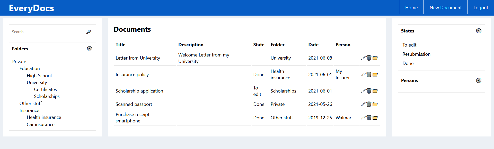
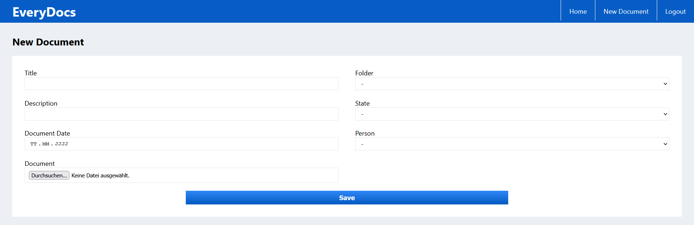

# EveryDocs Core

[](https://github.com/jonashellmann/everydocs-core/actions?query=workflow%3ARuby)


[](https://github.com/jonashellmann/everydocs-core/commits/)
[](https://github.com/jonashellmann/everydocs-core/commits/)

EveryDocs Core is the server-side part of EveryDocs. This project contains a [web interface](https://github.com/jonashellmann/everydocs-web/). All in all, EveryDocs is a simple Document Management System (DMS) for private use. It contains basic functionality to organize your documents digitally.

## Features

- Uploading PDF documents with a title, description and the date the document was created
- Organizing documents in folders and subfolders
- Adding people and processing states to documents
- Extracting the content from the PDF file for full-text search
- Encrypted storage of PDF files on disk
  - Encryption is automatically activated for all newly created users after upgrading to EveryDocs 1.5.0
  - For all other users encryption can be activated by adding a `secret_key` (generated for example by `openssl rand -hex 32`) and changing the flag `encryption_actived_flag` in the `users` database table for each user
  - If encrpytion is actived for a user, then there will be no content extraction and therefore no full-text search for this document
- Searching all documents by title, description or content of the document
- Creating new accounts (be aware that at the current moment everybody who knows the URL can create new accounts)
- Authentication via JsonWebToken with expiration and refresh mechanism
- REST-API for all CRUD operation for documents, folders, persons and processing states
- Mobile-friendly web UI

## Screenshots of the web interface




## Installation

### Docker Compose (recommended)

The easiest way to get started is to use Docker Compose. The ``docker-compose.yaml`` creates three containers for the database, Everydocs Core (available on port 5678) and the web interface (available on port 8080 and 8443).

#### Quick Start (Minimum Steps)

1. **Copy the environment template:**
   ```bash
   cp .env.example .env
   ```

2. **Generate strong passwords and secrets:**
   ```bash
   # Generate SECRET_KEY_BASE (Rails secret)
   openssl rand -hex 64
   
   # Generate strong MySQL passwords
   openssl rand -hex 32
   ```

3. **Edit `.env` and fill in the values:**
   ```bash
   SECRET_KEY_BASE=your_generated_secret_key_here
   MYSQL_ROOT_PASSWORD=your_strong_root_password
   MYSQL_PASSWORD=your_strong_user_password
   ```

4. **Create the web config file:**
   ```bash
   cp everydocs-web-config.js.example everydocs-web-config.js
   ```
   
   Edit `everydocs-web-config.js` and change the URL where EveryDocs Core will be accessible.

5. **Start the services:**
   ```bash
   docker-compose up -d
   ```

6. **Access the application:**
   - Web UI: http://localhost:8080
   - API: http://localhost:5678

#### Docker Compose Ports

| Port | Service | Description |
|------|---------|-------------|
| 5678 | API | EveryDocs Core API |
| 8080 | Web UI | HTTP Web Interface |
| 8443 | Web UI | HTTPS Web Interface |

#### Docker Compose Environment Variables

| Variable | Description | Required |
|----------|-------------|----------|
| `SECRET_KEY_BASE` | Rails secret key for encryption. Use `openssl rand -hex 64` to generate. | Yes |
| `MYSQL_ROOT_PASSWORD` | MySQL root password. Use a strong password. | Yes |
| `MYSQL_PASSWORD` | MySQL password for the `everydocs` user. Use a strong password. | Yes |

**⚠️ Security Warning:** Never use weak passwords or the example values in production.

### Manual Installation (Advanced)

If you prefer to run EveryDocs directly on your host system (not in Docker), follow these steps.

#### Prerequisites

- Ruby 3.1+
- Bundler
- MySQL or MariaDB database
- Node.js (for asset compilation)

#### Quick Start

1. **Install dependencies:**
   ```bash
   bundle install
   ```

2. **Copy the environment template:**
   ```bash
   cp .env.example .env
   ```

3. **Edit `.env` and configure all required variables:**
   ```bash
   # Required secrets
   SECRET_KEY_BASE=your_secret_key_base_here
   MYSQL_PASSWORD=your_mysql_password
   
   # Database connection
   EVERYDOCS_DB_ADAPTER=mysql2
   EVERYDOCS_DB_NAME=everydocs
   EVERYDOCS_DB_USER=everydocs
   EVERYDOCS_DB_HOST=localhost
   EVERYDOCS_DB_PORT=3306
   
   # Application settings
   RAILS_ENV=production
   PORT=5678
   LOG_DIR=log
   PID_DIR=tmp/pids
   ```

4. **Setup the database:**
   ```bash
   rails db:create RAILS_ENV=production
   rails db:migrate RAILS_ENV=production
   ```

5. **Start the server:**
   ```bash
   # Using scripts (recommended)
   ./start-app.sh
   
   # Or using Makefile
   make start
   ```

#### Convenience Scripts

| Script | Command | Description |
|--------|---------|-------------|
| Start | `./start-app.sh` | Start the server with PID management and logging |
| Stop | `./stop-app.sh` | Gracefully stop the server (SIGTERM → SIGKILL fallback) |
| Status | `./status.sh` | Check server status, uptime, memory, port connectivity |

#### Makefile Commands

A `Makefile` is provided for convenience:

| Command | Description |
|---------|-------------|
| `make start` | Start the server |
| `make stop` | Stop the server |
| `make restart` | Restart the server |
| `make status` | Check server status |
| `make smoke` | Run non-interactive smoke test (for CI) |
| `make test` | Run Rails tests |
| `make test-controllers` | Run controller tests only |
| `make logs` | Tail log files |
| `make logs-error` | Tail error log only |
| `make clean-logs` | Clean log files |
| `make help` | Show all available commands |

#### Manual Installation Environment Variables

| Variable | Description | Default | Required |
|----------|-------------|---------|----------|
| `SECRET_KEY_BASE` | Rails secret key for encryption | - | Yes |
| `MYSQL_PASSWORD` | Database password | - | Yes |
| `EVERYDOCS_DB_ADAPTER` | Database adapter | `mysql2` | No |
| `EVERYDOCS_DB_NAME` | Database name | `everydocs` | No |
| `EVERYDOCS_DB_USER` | Database user | `everydocs` | No |
| `EVERYDOCS_DB_HOST` | Database host | `localhost` | No |
| `EVERYDOCS_DB_PORT` | Database port | `3306` | No |
| `RAILS_ENV` | Rails environment | `production` | No |
| `PORT` | Server port | `5678` | No |
| `LOG_DIR` | Log directory | `log` | No |
| `PID_DIR` | PID file directory | `tmp/pids` | No |

#### Manual Installation Ports

| Port | Service | Description |
|------|---------|-------------|
| 5678 | API | EveryDocs Core API (default) |

**Note:** Port can be changed via the `PORT` environment variable.

### Docker (Single Container)

Start the container and make the API accessible on port ``8080`` by running the following commands. Of course, you can change the port in the last command.
Also make sure to check the folder that is mounted into the container. In this case, the uploaded files are stored in ``/data/everydocs`` on the host.
<pre>docker run -p 127.0.0.1:8080:5678/tcp -e SECRET_KEY_BASE="$(openssl rand -hex 64)" -v /data/everydocs:/var/everydocs-files jonashellmann/everydocs</pre>

You can configure the application by using the following environment variables:
- ``EVERYDOCS_DB_ADAPTER``: The database adapter (default: ``mysql2``)
- ``EVERYDOCS_DB_NAME``: The name of the database (default: ``everydocs``)
- ``EVERYDOCS_DB_USER``: The user for the database connection (default: ``everydocs``)
- ``EVERYDOCS_DB_PASSWORD``: The password for the database connection (no default)
- ``EVERYDOCS_DB_HOST``: The host of the database (default: ``localhost``)
- ``EVERYDOCS_DB_PORT``: The port of the database (default: ``3306``)

You might want to include this container in a network so it has access to a database container.
Also there are ways to connect to a database that runs on the host (e.g. see [Stackoverflow](https://stackoverflow.com/questions/24319662/from-inside-of-a-docker-container-how-do-i-connect-to-the-localhost-of-the-mach)).

## Environment Configuration

### Generating Strong Secrets

```bash
# Generate SECRET_KEY_BASE (required for all installations)
openssl rand -hex 64

# Generate strong MySQL passwords
openssl rand -hex 32

# Or use a more complex password
openssl rand -base64 32
```

### Environment File Configuration

The `.env` file is **ignored by git** (listed in `.gitignore`), so your secrets will never be committed.

Use the provided `.env.example` as a template:
```bash
cp .env.example .env
```

**⚠️ Never commit `.env` to version control!**

## Authentication

EveryDocs uses JWT (JSON Web Token) for authentication.

### Login

**Endpoint:** `POST /auth/login`

**Request:**
```json
{
  "email": "user@example.com",
  "password": "your_password"
}
```

**Response (200):**
```json
{
  "auth_token": "eyJhbGciOiJIUzI1NiJ9...",
  "expires_at": "2026-04-20T12:34:56Z"
}
```

**Token Lifetime:** 24 hours by default.

### Refresh Token

When your token expires, you can refresh it using the expired token (the signature must still be valid):

**Endpoint:** `POST /auth/refresh`

**Request Header:**
```
Authorization: Bearer <your_token>
```

**Response (200):**
```json
{
  "auth_token": "eyJhbGciOiJIUzI1NiJ9...",
  "expires_at": "2026-04-20T12:34:56Z"
}
```

### Error Codes

All authentication errors return HTTP 401 with a JSON body containing an error code:

| Error Code | Description |
|------------|-------------|
| `AUTHENTICATION_ERROR` | Invalid email or password during login |
| `MISSING_TOKEN` | No Authorization header provided |
| `INVALID_TOKEN` | Token is malformed or has invalid signature |
| `EXPIRED_TOKEN` | Token has expired (use refresh endpoint) |

### Frontend Token Flow Example

```javascript
async function makeRequest(url, options = {}) {
  const token = getStoredToken();
  
  const response = await fetch(url, {
    ...options,
    headers: {
      ...options.headers,
      'Authorization': `Bearer ${token}`
    }
  });
  
  if (response.status === 401) {
    const error = await response.json();
    
    if (error.code === 'EXPIRED_TOKEN') {
      // Try to refresh token
      const refreshResponse = await fetch('/auth/refresh', {
        method: 'POST',
        headers: { 'Authorization': `Bearer ${token}` }
      });
      
      if (refreshResponse.ok) {
        const { auth_token } = await refreshResponse.json();
        storeToken(auth_token);
        // Retry original request with new token
        return makeRequest(url, options);
      }
    }
    
    // Redirect to login
    window.location.href = '/login';
    throw new Error('Authentication failed');
  }
  
  return response;
}
```

## CI/CD and Testing

### Smoke Test (Non-Interactive)

A `make smoke` command is available for CI environments:

```bash
make smoke
```

This command performs:
1. Checks for `.env` file
2. Verifies `SECRET_KEY_BASE` is set
3. Checks required commands (ruby, bundle, rails)
4. Verifies bundle dependencies
5. Runs database migrations for test environment
6. Runs the full test suite

### Running Tests

```bash
# Run all tests
make test

# Run controller tests only
make test-controllers

# Or directly
rails test RAILS_ENV=test
```

## Backup

To backup your application, you can simply use the backup functionality of your
database. For example, a MySQL/MariaDB DBMS may use mysqldump.

Additionally you have to backup the place where the documents are stored. You
can configure this in config/settings.yml. To restore, just put the documents back in that location.

## Routes Documentation

To learn about the routes the API offers, run the following command: ``rake routes``
